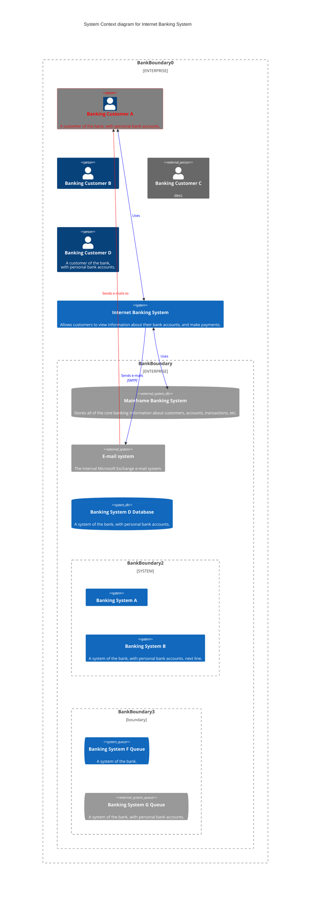

## Graduate Embedded Project Proposal: Pinball

Design and build of a half-scale pinball table. Modern pinball tables use 48V systems with 27mm steel balls. We will reduce our power to 24V for easier sourcing of components, and reduce the size of the steel ball to 19mm (~½ mass of 27mm) to maintain the best approximation of game feel. The approximate layout will match the screenshot on the right of Pokemon Pinball : Sapphire’s table, but may not remain Pokemon themed. To reduce overall complexity, features 2, 4, 5,  8, & 10-13 are intended to be removed.

Mechanical design components will be largely laser cut frames, with acrylic and 3D printed parts as necessary for cosmetic and detail work as needed. Solenoid assemblies require some mechanical level design and may be waterjet aluminum to eliminate potential issues in the timescale of this project. A poster print may be requested to serve as the art for the pinball board. AC and 24V components added by Nick will be soldered and covered for safety.
While individual sensors may be considered trivial, the greater embedded programming challenge is in the implementation of a large state machine with numerous inputs and feedback methods. Unless time cost is trivial, all components active during gamestate must be non blocking to ensure high speed play is responsive.

## Details

### Implemented Components

| Name                | Components                 | Implemented | Notes                                           |
| ------------------- | -------------------------- | ----------- | ----------------------------------------------- |
| Flipper Assembly    | Solenoid, PWM, FET         | Yes         | Risk of burning out solenoids                   |
| Pop Bumper Assembly | Solenoid, FET, Drop Switch | Yes         | Switch design extremely challenging             |
| Arcade Buttons      | 2x 30mm 1x 24mm Sanwa OBSN | Yes         | Barely worth mentioning                         |
| Ball Detection      | Hall Effect sensors        | Not Yet     | Would like to have on i2c bus but not practical |
| Screen              | i2c LCD                    | Not Yet     |
| Tilt Detection      | IMU                        | Not Yet     |

### Removed Components

| Name               | Components                          | Implemented | Justification                    |
| ------------------ | ----------------------------------- | ----------- | ------------------------- |
| Name Input         | Hex Keypad                          | No          |
| Slingshot Assembly | Solenoid, FET, Prox Switch          | No          | Switch design challenging |
| Lights             | Addressable LED                     | No          |
| Sounds             | Speakers, SD reader and playback IC | No          | Need to find sfx library  |

### C4 Context Diagram

### Libraries

Main non-default library that i did not write is the Scheduler Library from (GITHUB LINK HERE)
They look like all MIT licenses.

## Team & Qualifications

Nick is an experienced engineer and computer scientist with a large background in robotics and electromechanical design. His work in Engineering in the creation of similar equipment and guiding student embedded design projects, is highly relevant, and he has work experience with industrial and home robotics. As a student he retrofit a drive by wire systems into a golf cart for undergraduate senior design, and is currently performing research in robotics and AI with Dr. Ho. Recent personal projects include custom fighting game controllers, keyboards, and an MTG card sorting machine.
