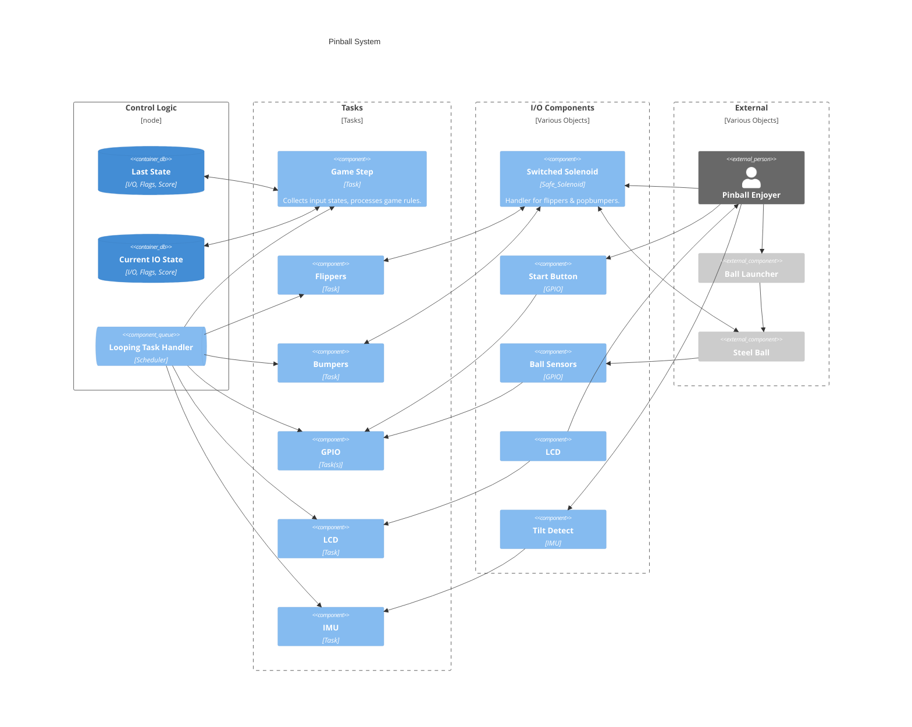

# Graduate Embedded Project Proposal: Pinball

This repository contains a project for the design and build of a half-scale pinball table. Modern pinball tables use 48V systems with 27mm steel balls. We will reduce our power to 24V for easier sourcing of components, and reduce the size of the steel ball to 19mm (~½ mass of the standard) to maintain the best approximation of game feel. The approximate layout will match the screenshot on the right of Pokemon Pinball : Sapphire’s table, but may not remain Pokemon themed. To reduce overall complexity, features 2, 4, 5,  8, & 10-13 are intended to be removed.

Mechanical design components will be largely laser cut frames, with acrylic and 3D printed parts as necessary for cosmetic and detail work as needed. Solenoid assemblies require some mechanical level design and may be waterjet aluminum to eliminate potential issues in the timescale of this project. A poster print may be requested to serve as the art for the pinball board. AC and 24V components added by Nick will be soldered and covered for safety.
While individual sensors may be considered trivial, the greater embedded programming challenge is in the implementation of a large state machine with numerous inputs and feedback methods. Unless time cost is trivial, all components active during gamestate must be non blocking to ensure high speed play is responsive. To accomplish this, we are best off using interrupts, an event system, or a scheduler. We selected a scheduler to ensure constant polling of solenoids to avoid burnout.

## Details

### Implemented Components

| Name                | Components                 | Implemented | Notes                                             |
| ------------------- | -------------------------- | ----------- | ------------------------------------------------- |
| Flipper Assembly    | Solenoid, PWM, FET         | Yes         | Safe_Solenoid class to avoid burnout              |
| Pop Bumper Assembly | Solenoid, PWM, FET         | Yes         | ASM design extremely challenging                  |
| Arcade Buttons      | 2x 30mm 1x 24mm Sanwa OBSN | Yes         |                                                   |
| Ball Detection      | Hall Effect sensors        | Not Yet     | Not practical to have on i2c, Low/High on digital |
| Screen              | i2c LCD                    | Not Yet     | Library                                           |
| Tilt Detection      | IMU                        | Not Yet     | Library                                           |
| Scheduler           | Software Only              | Yes         | Reduces energy usage and simplifies main.cpp      |

### Removed Components

| Name               | Components                          | Justification                                |
| ------------------ | ----------------------------------- | -------------------------------------------- |
| Name Input         | Hex Keypad                          | Limited affect on total design               |
| Slingshot Assembly | Solenoid, FET, Prox Switch          | Extraneous mechanical design                 |
| Lights             | Addressable LED                     | Time constraint, simple implementation       |
| Sounds             | Speakers, SD reader and playback IC | Couldn't find licensable pokemon sfx library |

### C4 Context Diagram

### External Libraries

| Name                    | License      | Notes                                                  |
| ----------------------- | ------------ | ------------------------------------------------------ |
| SPI                     | LGPL 2.1     | AVR Core library                                       |
| TaskScheduler           | BSD-3-Clause |                                                        |
| Liquid_Crystal_i2c      | LGPL 2.1*    | None listed, but derived from LGPL 2.1 so must inherit |
| Adafruit_MPU6050        | BSD-3-Clause |                                                        |
| Adafruit BusIO          | MIT          |                                                        |
| Adafruit Unified Sensor | MIT          |                                                        |

## Team: Qualifications & Eval

Nick is an experienced engineer and computer scientist with a large background in robotics and electromechanical design. His work in Engineering in the creation of similar equipment and guiding student embedded design projects, is highly relevant, and he has work experience with industrial and home robotics. As a student he retrofit a drive by wire systems into a golf cart for undergraduate senior design, and is currently performing research in robotics and AI with Dr. Ho. Recent personal projects include custom fighting game controllers, keyboards, and an MTG card sorting machine.

Nick was responsible for the entirety of the project. With these skills Nick has done well with the project and has ensured code is easily modifiable to allow cut components to be reintroduced as needed. Between unfortunate personal circumstances and full-time responsibilities more features than desired were cut before final delivery.
